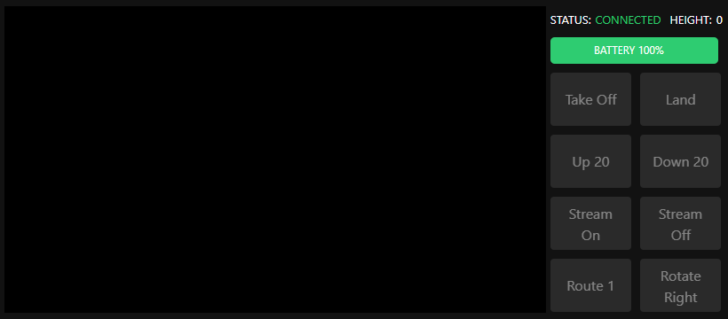
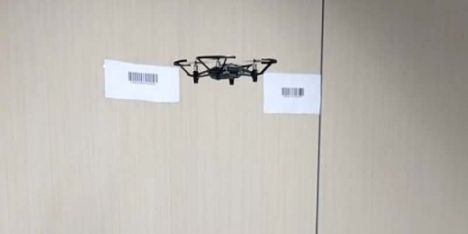

# Tello Drone with Node.JS
Manage your Tello drone with Node.JS!

## Warning
Use at your own risk, test commands with the props removed first.

## Created with
1. Node.JS
2. Bootstrap
3. FFmpeg
4. ZBar
5. DJI Tello EDU

## Installation
1. Install `Node.JS` https://nodejs.org/en/
2. Install `FFmpeg` https://ffmpeg.org/
3. Install `ZBar` http://zbar.sourceforge.net/
4. `git clone https://github.com/fabriziopace/tello-drone-node.git`
5. cd `src`
6. `npm install`
7. connect your pc to Tello drone via wifi
8. `npm run dev`
9. go to https://localhost:3000
